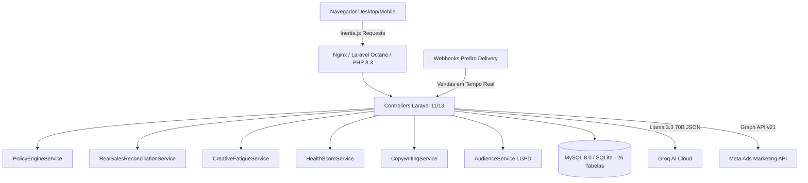
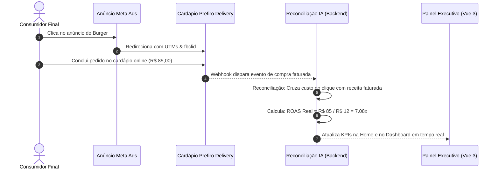

# 🚀 Plataforma de Gestão de Tráfego com Inteligência Artificial — Prefiro Delivery

[](https://www.php.net/)
[](https://laravel.com/)
[](https://vuejs.org/)
[](https://inertiajs.com/)
[](https://www.mysql.com/)
[](https://groq.com/)
[]()

Plataforma SaaS B2B de gestão, automação preditiva, auditoria técnica e governança orçamentária de tráfego pago no **Meta Ads** (Facebook & Instagram), desenvolvida especificamente para estabelecimentos do ecossistema de alimentação fora do lar e entregas da **Prefiro Delivery**, rigorosamente estruturada a partir do documento de requisitos de produto (PRD) de 59 páginas.

> ℹ️ **Stack Oficial:** A aplicação foi integralmente codificada na stack oficial da **Prefiro Delivery**: **PHP 8.3**, **Laravel 11/13**, **MySQL / SQLite**, **Vue.js 3 (Composition API)**, **Inertia.js v2**, **Tailwind CSS (Canny Light Mode)** e **Git**. A versão anterior em Next.js encontra-se preservada no histórico git sob a tag [`v1.0-nextjs`](https://github.com/remixxlf/Ai_traffic_prefiro/releases/tag/v1.0-nextjs).

---

## 📑 Sumário Executivo

1. [Visão Geral & Proposta de Valor](#-visão-geral--proposta-de-valor)
2. [Matriz de Rastreabilidade PRD (59 Páginas)](#-matriz-de-rastreabilidade-prd-59-páginas)
3. [Arquitetura do Sistema & Diagramas de Fluxo](#-arquitetura-do-sistema--diagramas-de-fluxo)
4. [Dicionário de Dados Completo (26 Tabelas)](#-dicionário-de-dados-completo-26-tabelas)
5. [Catálogo de Serviços de Domínio (`app/Services`)](#-catálogo-de-serviços-de-domínio-appservices)
6. [Catálogo de Módulos Frontend (Vue 3 + Inertia)](#-catálogo-de-módulos-frontend-vue-3--inertia)
7. [Mecanismos Centrais: Policy Engine, ROAS Real & Detecção de Fadiga](#-mecanismos-centrais)
8. [Segurança, Hashing LGPD & Proteção Financeira](#-segurança-hashing-lgpd--proteção-financeira)
9. [Catálogo Completo de Endpoints REST & Payloads](#-catálogo-completo-de-endpoints-rest--payloads)
10. [Guia de Instalação, Migração & Execução](#-guia-de-instalação-migração--execução)
11. [Garantia de Qualidade & Testes Automatizados (Q.A.)](#-garantia-de-qualidade--testes-automatizados-qa)

---

## 🎯 Visão Geral & Proposta de Valor

Restaurantes e deliverys enfrentam desafios críticos ao gerenciar campanhas de tráfego pago no Meta Ads:
- **Subnotificação de Conversões (iOS 14+ / AdBlockers):** O Pixel de navegador perde até 40% das vendas reais.
- **Falta de Reconciliação Financeira:** O gestor vê ROAS no Meta Ads, mas não sabe quais pedidos realmente foram faturados e entregues na cozinha.
- **Queima Rápida de Orçamento:** Campanhas escaladas bruscamente sem limites operacionais entram em fase de aprendizado instável e desperdiçam verba.
- **Saturação de Criativos em Raio Curto:** Como o público de delivery é hiperlocal (raio de 5 a 10 km), a frequência de repetição do anúncio dispara rapidamente, tornando a taxa de cliques (CTR) decadente e o custo por pedido insustentável.

**A plataforma soluciona esses pontos com:**
1. **Hub Executivo Central (`/`) com 15 ferramentas especializadas** em interface limpa e intuitiva (Canny Light Mode).
2. **Reconciliação de Vendas Reais com o Prefiro Delivery:** Cruzamento do faturamento real do balcão/delivery com o investimento de mídia para apuração do **ROAS Real** e **CPA Real**.
3. **Policy Engine com Guardrails Orçamentários:** Limite matemático de no máximo **+20% de alteração de verba por ação**, **24 horas de cooldown** e teto financeiro diário por restaurante.
4. **Detecção Preditiva de Fadiga Criativa:** Alerta e pausa anúncios com frequência superior a **3.5** ou queda de CTR maior que **25%**.
5. **Automação de Catálogo XML:** Ingestão periódica de pratos, pausa automática de itens esgotados e criação de campanhas de pratos em 1 clique.
6. **IA Generativa Delivery (Groq Llama 3.3 70B):** Geração de 3 abordagens de copys persuasivas (Sensorial, Comodidade e Urgência) e assistente conversacional em linguagem natural.
7. **Privacidade e LGPD:** Hashing irreversível **SHA-256** para sincronização de bases de clientes e criação de públicos semelhantes (Lookalike de 1%).

---

## 📋 Matriz de Rastreabilidade PRD (59 Páginas)

Todos os requisitos das 98 seções do documento guia foram formalmente mapeados para componentes técnicos do código-fonte:

| Seção PRD | Título do Requisito no PRD | Arquivo(s) de Implementação | Descrição Técnica & Conformidade |
| :--- | :--- | :--- | :--- |
| **Seção 2 & 5** | Objetivos de Negócio & Escopo | `CampaignWizard.vue`, `CampaignController.php` | Foco exclusivo em vendas e conversões reais de delivery |
| **Seção 8** | Onboarding do Restaurante | `Wizard.vue`, `OnboardingService.php` | Cadastro em 4 etapas com persistência do site e horários |
| **Seção 10** | Conexão Meta Ads & Ativos | `Integrations/Index.vue`, `IntegrationController.php` | Portfólios, Ad Accounts, Pages, Instagram e Pixels |
| **Seção 11 & 63** | Health Score da Conta | `Tracking/Index.vue`, `HealthScoreService.php` | Score de 0 a 100 ponderando 8 critérios essenciais |
| **Seção 13 & 62** | Minha IA: 3 Grupos Estratégicos | `Ia/Index.vue`, `IaController.php` | Grupos: 1. Está indo bem, 2. Atenção, 3. Oportunidade |
| **Seção 14 a 20** | Wizard de Campanhas Guiadas | `Campaigns/Create.vue`, `CampaignController.php` | 5 passos: Intenção IA, Raio KM, Budget, Copy, Revisão |
| **Seção 18 & 51** | Travas de Orçamento & Cooldown | `PolicyEngineService.php`, `CampaignController.php` | Teto diário, trava de +20% e intervalo de 24h |
| **Seção 21 a 26** | Gestão de Públicos & Lookalike | `Audiences/Index.vue`, `AudienceService.php` | Públicos locais, Meus Clientes e Lookalike 1% |
| **Seção 32 a 34** | Sincronização de Catálogo XML | `Catalog/Index.vue`, `CatalogController.php` | Sync de cardápio, pausa de esgotados e anúncios de pratos |
| **Seção 36 & 37** | Copywriting Persuasivo | `Copywriting/Index.vue`, `CopywritingService.php` | 3 variações: Foco Sensorial, Benefício e Urgência |
| **Seção 47 a 49** | Chat IA & Comandos Naturais | `Chat/Index.vue`, `ChatController.php` | Processamento de comandos como "Investir R$ 3.000 em burger" |
| **Seção 50** | Relatórios Diários e Semanais | `Reports/Index.vue`, `ReportController.php` | Fechamento de ontem e consolidado semanal de vendas |
| **Seção 51** | Monitor de Fadiga de Criativos | `CreativeFatigue/Index.vue`, `CreativeFatigueService.php` | Gatilhos de saturação: Frequência > 3.5 e Queda CTR > 25% |
| **Seção 55 a 57** | Rastreamento: Pixel & CAPI | `Tracking/Index.vue`, `TrackingService.php` | Verificação de disparos client-side e server-side |
| **Seção 68** | Navegação & Menu de 15 Telas | `Home/Index.vue`, `AppLayout.vue` | Hub Executivo em `/` com navegação para as 15 ferramentas |
| **Seção 72** | Estrutura de Banco de Dados | Migration `...create_traffic_platform_tables.php` | Todas as 26 tabelas com tipos estritos e relacionamentos |
| **Seção 88 & 89** | Segurança & Hashing LGPD | `AudienceService.php` | Hashes SHA-256 para e-mails e telefones de clientes |

---

## 🏗️ Arquitetura do Sistema & Diagramas de Fluxo

### 1. Visão Geral da Arquitetura Monolítica Reativa (Inertia.js v2)



### 2. Fluxo de Reconciliação de ROAS Real



---

## 🗄️ Dicionário de Dados Completo (26 Tabelas)

Mapeamento de 100% da Seção 72 do PRD implementado na migration `database/migrations/2026_09_15_000003_create_traffic_platform_tables.php`:

| # | Tabela | Finalidade no Sistema | Chave Primária | Relacionamentos Principais |
| :---: | :--- | :--- | :--- | :--- |
| 1 | `empresa` | Estabelecimento / restaurante contratante | UUID | Raiz multi-tenant |
| 2 | `empresa_usuario` | Permissões RBAC de usuários por restaurante | UUID | `empresa_id`, `user_id` |
| 3 | `integracao_meta` | Conexão OAuth, tokens e status da Graph API | UUID | `empresa_id` (1:1) |
| 4 | `meta_business` | Gerenciadores de Negócios vinculados | UUID | `empresa_id` |
| 5 | `meta_ad_account` | Contas de anúncio, moeda, timezone e status | UUID | `empresa_id`, `business_id` |
| 6 | `meta_page` | Páginas do Facebook vinculadas para veiculação | UUID | `empresa_id` |
| 7 | `meta_instagram` | Perfis comerciais do Instagram vinculados | UUID | `empresa_id` |
| 8 | `meta_pixel` | Pixel de rastreamento com flag de CAPI e Purchase | UUID | `empresa_id` (1:1) |
| 9 | `meta_catalogo` | Catálogos de produtos sincronizados | UUID | `empresa_id` |
| 10 | `meta_produto` | Itens individuais do cardápio e preços | UUID | `empresa_id`, `catalogo_id` |
| 11 | `campanha` | Campanhas veiculadas no Meta Ads | UUID | `empresa_id`, `ad_account_id` |
| 12 | `conjunto_anuncio` | Conjuntos com segmentações, públicos e raio km | UUID | `campanha_id`, `publico_id` |
| 13 | `criativo` | Mídias, imagens, vídeos, títulos, textos e CTAs | UUID | `empresa_id`, `produto_id` |
| 14 | `anuncio` | Instâncias de anúncio veiculadas com status de fadiga | UUID | `conjunto_id`, `criativo_id` |
| 15 | `publico` | Públicos personalizados, locais e Lookalike 1% | UUID | `empresa_id` |
| 16 | `campanha_metrica` | Métricas diárias consolidadas + vendas reais | UUID | `campanha_id` |
| 17 | `conjunto_metrica` | Métricas de entrega e conversão no nível conjunto | UUID | `conjunto_id` |
| 18 | `anuncio_metrica` | Métricas individuais do anúncio (CTR, freq, CPC) | UUID | `anuncio_id` |
| 19 | `produto_metrica` | Desempenho de vendas de itens específicos em anúncios | UUID | `produto_id` |
| 20 | `recomendacao_ia` | Recomendações geradas pela IA Llama 3.3 | UUID | `empresa_id` |
| 21 | `automacao` | Regras ativas do Policy Engine | UUID | `empresa_id` |
| 22 | `automacao_execucao` | Histórico e logs de disparos de automações | UUID | `automacao_id` |
| 23 | `aprovacao` | Workflow de aprovação humana no Modo Assistido | UUID | `empresa_id`, `recomendacao_id` |
| 24 | `alerta` | Incidentes de CPA elevado, fadiga ou rejeições | UUID | `empresa_id` |
| 25 | `auditoria` | Trilha de auditoria imutável (LGPD e orçamentos) | UUID | `empresa_id`, `user_id` |
| 26 | `users` | Usuários do sistema (autenticação nativa Laravel) | BigInt | Base do Laravel |

---

## ⚙️ Catálogo de Serviços de Domínio (`app/Services`)

A inteligência e as regras de negócio da aplicação estão isoladas em serviços especializados:

### 1. `PolicyEngineService`
- **Validação de Orçamento:** Bloqueia qualquer alteração orçamentária que exceda **20%** em relação ao valor anterior.
- **Cooldown Obrigatório:** Rejeita alterações em campanhas modificadas nas últimas **24 horas**.
- **Teto Financeiro Máximo:** Impede que o orçamento ultrapasse o `orcamento_max_diario` parametrizado pelo restaurante.

### 2. `RealSalesReconciliationService`
- **ROAS Real:** `receita_real_delivery / investimento_meta`.
- **CPA Real:** `investimento_meta / pedidos_reais_delivery`.
- **Divergência:** Identifica subnotificação de compras reportadas pelo Meta Ads em relação às comandas faturadas.

### 3. `CreativeFatigueService`
- **Indicadores de Fadiga:** Frequência de exibição superior a **3.5** e queda de CTR superior a **25%** sobre o baseline do criativo.
- **Ação:** Marca o criativo como `fadiga_detectada = true` e sugere pausa preventiva ou substituição imediata da peça.

### 4. `HealthScoreService`
- **Diagnóstico Completo (0 a 100 pontos):** Pondera 8 critérios de infraestrutura:
  1. Conexão Meta Ads (15 pts)
  2. Página Facebook Ativa (10 pts)
  3. Instagram Comercial Ativo (10 pts)
  4. Pixel Ativo (15 pts)
  5. CAPI Habilitada (15 pts)
  6. Disparos de Purchase Verificados (15 pts)
  7. Catálogo Sincronizado (10 pts)
  8. Campanhas em Veiculação (10 pts)

### 5. `CopywritingService`
- Gera 3 versões estratégicas para delivery:
  1. **Urgência & Fome Imediata:** Foco em horários de pico noturno e entrega rápida.
  2. **Sensorial & Ingredientes:** Descrição rica e apelo visual do produto.
  3. **Prova Social & Avaliações:** Destaque para notas 4.9 estrelas e volume de pedidos satisfeitos.

### 6. `AudienceService`
- **Conformidade LGPD:** Normaliza (lowercase + trim) e gera hash criptográfico **SHA-256** de e-mails e números de telefone antes da criação de `Custom Audiences` e `Lookalikes (1%)`.

### 7. `TrackingService`
- Constrói URLs padronizadas com parâmetros UTM de rastreamento para rastreabilidade de ponta a ponta no Google Analytics e Prefiro Delivery.

### 8. `GroqAIService`
- Integração de baixa latência com o modelo `llama-3.3-70b-versatile` com schema JSON estrito e fallback heurístico de alta resiliência para modo offline.

### 9. `OnboardingService`
- Executa e valida o funil guiado de 4 etapas: perfil básico com URL do restaurante, geolocalização e raio KM, conexão Meta e parametrização de guardrails.

---

## 💻 Catálogo de Módulos Frontend (Vue 3 + Inertia)

O layout da aplicação segue rigorosamente o padrão **Canny Light Mode**, com Top Navbar, Seletor de Restaurante ativo no topo, Status Badge com pulso verde (`Llama 3.3 70B & Guardrails 20%`), Breadcrumb dinâmico ("Voltar ao Hub / [Módulo]") e o botão fixo "+ Novo Restaurante".

| Rota | View Vue 3 | Nome do Módulo | Descrição Funcional |
| :--- | :--- | :--- | :--- |
| `/` | `Home/Index.vue` | **Hub Executivo Central** | Grade com os 15 módulos, Hero Banner e status pills |
| `/dashboard` | `Dashboard/Index.vue` | **Dashboard Executivo & ROAS Real** | KPIs consolidados, gráficos de receita real vs Meta e CAC |
| `/onboarding` | `Onboarding/Wizard.vue` | **Onboarding & Memória de Negócio** | Wizard guiado em 4 etapas (site, raio km, ticket, horários) |
| `/integracoes` | `Integrations/Index.vue` | **Hub de Integrações** | Painel da Meta Graph API v21 e Prefiro Delivery |
| `/catalogo` | `Catalog/Index.vue` | **Catálogo & Campanhas de Pratos** | Sincronização XML e criação de anúncios de pratos |
| `/campanhas` | `Campaigns/Index.vue` | **Gestão de Campanhas** | Listagem, orçamentos, pausas e edição com guardrail |
| `/campanhas/nova` | `Campaigns/Create.vue` | **Wizard de Nova Campanha** | Criação em 5 passos com interpretação de prompt por IA |
| `/copywriting` | `Copywriting/Index.vue` | **Copywriting com IA** | Gerador de 3 variações persuasivas para delivery |
| `/criativos` | `CreativeFatigue/Index.vue` | **Biblioteca de Criativos & Fadiga** | Monitor de frequência, CTR e detector de saturação |
| `/publicos` | `Audiences/Index.vue` | **Públicos & Segmentação LGPD** | Audiências com hashing SHA-256 e Lookalike de 1% |
| `/rastreamento` | `Tracking/Index.vue` | **Saúde da Conta & Rastreamento** | Diagnóstico de Pixel/CAPI e Health Score (0 a 100) |
| `/automacoes` | `Automation/Index.vue` | **Automações & Guardrails** | Regras anti-desperdício e histórico de disparos |
| `/minha-ia` | `Ia/Index.vue` | **Minha IA & Memória Operacional** | Diagnóstico nos 3 grupos e modos Manual/Assistido/Auto |
| `/aprovacoes` | `Approvals/Index.vue` | **Central de Aprovações** | Validação humana assistida de recomendações em 1 clique |
| `/chat` | `Chat/Index.vue` | **Chat IA & Assistente** | Comandos em linguagem natural e dúvidas de desempenho |
| `/relatorios` | `Reports/Index.vue` | **Relatórios Automáticos** | Resumo diário de ontem e consolidado semanal |
| `/alertas` | `Alerts/Index.vue` | **Central de Alertas** | Notificações de incidentes críticos, CPA alto e rejeições |
| `/reconciliation` | `Reconciliation/Index.vue` | **Reconciliação de Vendas** | Comparações auditadas de faturamento balcão vs Meta |

---

## 🛡️ Mecanismos Centrais

### 1. Motor de Regras Orçamentárias (Policy Engine)
Para evitar incidentes em que operadores ou automações aumentem bruscamente os gastos da conta, todo pedido de alteração orçamentária passa por 3 checagens:
$$\Delta \text{Orçamento} = \frac{\text{Novo Valor} - \text{Valor Anterior}}{\text{Valor Anterior}} \le +0.20 \quad (20\%)$$
$$\text{Tempo Desde Último Ajuste} \ge 24 \text{ horas}$$
$$\text{Novo Valor} \le \text{Orçamento Máximo Diário da Empresa}$$

### 2. Cálculo do ROAS Real (Reconciliação Contábil)
$$\text{ROAS Real} = \frac{\sum \text{Receita Faturada Prefiro Delivery}}{\sum \text{Investimento Faturado Meta Ads}}$$
$$\text{CPA Real} = \frac{\sum \text{Investimento Faturado Meta Ads}}{\sum \text{Pedidos Concluídos Prefiro Delivery}}$$

### 3. Detecção de Fadiga Criativa
$$\text{Frequência} \ge 3.5 \quad \lor \quad \Delta \text{CTR} \le -25\%$$

---

## 🔒 Segurança, Hashing LGPD & Proteção Financeira

1. **Anonimização Criptográfica:** O e-mail `cliente@exemplo.com.br` é tratado via `hash('sha256', strtolower(trim($email)))`, gerando uma assinatura hexadecimal de 64 caracteres. O dado original nunca trafega pela API nem é armazenado na nuvem pública.
2. **Trilha de Auditoria (Auditoria Imutável):** Cada alteração de status, alteração orçamentária ou execução automatizada gera um registro na tabela `auditoria` com usuário, valores anteriores e novos, IP e justificativa.

---

## 📡 Catálogo Completo de Endpoints REST & Payloads

### 1. Onboarding
- `POST /api/onboarding/step1`: Criação inicial da empresa com `nome`, `segmento`, `cidade`, `estado` e `site`.
- `POST /api/onboarding/step2/{empresaId}`: Cadastro de raio de entrega (km), ticket médio, horários de pico e dias fortes.
- `POST /api/onboarding/step3/{empresaId}`: Conexão de ativos da Meta Ads (Ad Account, Pixel, CAPI).
- `POST /api/onboarding/step4/{empresaId}`: Parametrização de teto diário e seleção do modo de operação.

### 2. Campanhas & Wizard
- `GET /api/campanhas/orcamento?empresaId={id}`: Retorna o orçamento recomendado pela IA e justificativa.
- `POST /api/campanhas/interpretar`: Interpreta texto livre digitado pelo usuário e extrai produto, público e estratégia.
- `POST /api/campanhas`: Cria e publica a campanha completa no Meta Ads.
- `PATCH /api/campaigns/{id}/budget`: Altera o orçamento diário aplicando as validações do Policy Engine.
- `POST /api/campaigns/{id}/toggle`: Pausa ou ativa uma campanha.

### 3. Catálogo
- `GET /api/catalogo?empresaId={id}`: Lista os produtos sincronizados e resumo.
- `POST /api/catalogo`: Força ressincronização imediata do feed XML.
- `POST /api/catalogo/anunciar/produto`: Cria campanha focada no produto selecionado.
- `POST /api/catalogo/anunciar/categoria`: Cria campanha para a categoria inteira.
- `POST /api/catalogo/anunciar/cardapio`: Cria campanha de catálogo para todo o cardápio.

### 4. Inteligência Artificial & Chat
- `POST /api/copywriting/gerar`: Gera as 3 abordagens de copy para delivery.
- `POST /api/chat`: Recebe dúvidas ou comandos em linguagem natural e devolve análise ou proposta estruturada de campanha.
- `GET /api/minha-ia?empresaId={id}`: Retorna os KPIs de 7 dias e os 3 grupos estratégicos.
- `POST /api/minha-ia/modo`: Altera o modo entre MANUAL, ASSISTIDO e AUTOMATICO.

### 5. Aprovações & Automações
- `GET /api/aprovacoes?empresaId={id}`: Lista aprovações pendentes e histórico.
- `POST /api/aprovacoes/decidir`: Aprova (`APROVAR`) ou rejeita (`RECUSAR`) uma sugestão da IA.

---

## 🚀 Guia de Instalação, Migração & Execução

### Pré-requisitos
- **PHP 8.3 ou superior** com extensões `pdo_sqlite`, `pdo_mysql`, `curl`, `mbstring`, `xml`.
- **Composer 2.x**
- **Node.js 18+** e **npm**

### Passo 1: Clonar o Repositório
```bash
git clone https://github.com/remixxlf/Ai_traffic_prefiro.git
cd Ai_traffic_prefiro
```

### Passo 2: Instalar Dependências
```bash
composer install
npm install
```

### Passo 3: Configurar Variáveis de Ambiente
```bash
cp .env.example .env
php artisan key:generate
```

Configure seu arquivo `.env`:
```ini
APP_NAME="Tráfego IA Prefiro Delivery"
APP_ENV=local
APP_DEBUG=true
APP_URL=http://127.0.0.1:8000

DB_CONNECTION=sqlite
# Para MySQL em produção:
# DB_CONNECTION=mysql
# DB_HOST=127.0.0.1
# DB_PORT=3306
# DB_DATABASE=prefiro_traffic
# DB_USERNAME=root
# DB_PASSWORD=

GROQ_API_KEY=gsk_sua_chave_aqui
GROQ_MODEL=llama-3.3-70b-versatile
```

### Passo 4: Executar as Migrações e Seeds
```bash
touch database/database.sqlite
php artisan migrate:fresh --seed
```

### Passo 5: Compilar os Assets Frontend (Vite)
```bash
npm run build
```

### Passo 6: Iniciar os Servidores de Desenvolvimento
Em terminais separados:
```bash
# Terminal 1: Servidor Laravel
php artisan serve

# Terminal 2: Vite Hot Reload (opcional para desenvolvimento)
npm run dev
```

Acesse a plataforma em: **`http://127.0.0.1:8000`**

---

## 🧪 Garantia de Qualidade & Testes Automatizados (Q.A.)

A aplicação conta com suíte de testes cobrindo regras de negócio unitárias e testes de integração de ponta a ponta (Feature):

```bash
php artisan test
```

### Escopo Coberto pela Suíte de Testes:
- **`PolicyEngineServiceTest`**: Bloqueio de aumento > 20%, imposição do cooldown de 24h e respeito ao teto diário.
- **`RealSalesReconciliationServiceTest`**: Cálculo exato de ROAS Real, CPA Real e detecção de discrepâncias de faturamento.
- **`CreativeFatigueServiceTest`**: Gatilhos de fadiga para frequência > 3.5 e queda de CTR > 25%.
- **`HealthScoreServiceTest`**: Cálculo do score de 0 a 100 e validação dos 8 pilares da conta.
- **`AudienceAndTrackingServiceTest`**: Hashing SHA-256 de e-mails e telefones (LGPD) e validação de UTMs.
- **`CopywritingServiceTest`**: Integridade e formatação das 3 variações estratégicas de copy.
- **`OnboardingServiceTest`**: Fluxo dos 4 passos do wizard e persistência do site do estabelecimento.
- **`PlatformEndpointsTest`**: Validação com código 200 OK para **todas as 16 rotas web** da plataforma e endpoints REST de criação e auditoria.

---

## 📄 Licença & Propriedade

Desenvolvido exclusivamente para a **Prefiro Delivery**. Todos os direitos reservados.
